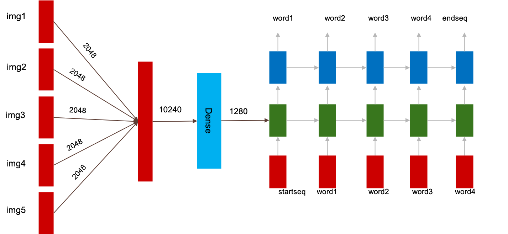

# Project Details
## Baseline 1 Model

<!---- Will come up with a similar image for this model as well ------>
We started off our exploration with a simple Image Caption problem where we generate captions to individual images in an album or story and concatenate them to generate a narration to the story. With so many Image Captioning models out there, generating sensible and meaningful captions was never much of a challenge. Also, when captions for related sequence of images are concatenated it results in a neat, coherent narration.

Are we done? NO! Not at all.

The major challenge arose when we gave this model a sequence of unrelated images. It resulted in a narration which had minimum coherence across individual captions. The narration used wide variety of terms ranging from “fireworks” to “the apple on the tree” and thus made no sense. 

Nonetheless, this model served its purpose of producing a good benchmark for further experiments.
## Baseline 2 Model
<!--- commented since it seems redundant given the dataset part in the appendix --->
<!--- Thought the dataset claims to have <#number> of images, there is a huge subset of captions which doesn’t have their respective images <#link to the FAQ> and also vice versa. 
However, we do include these captions in this baseline model but with the respective image embeddings of zero (signifies the unavailability of the context) which is similar to what we do in case of text - UNK token. This also results in ample availability of data to train the decoder as a simple language model. --->
#### Pre-Processing
Preprocessing of images is done in the same way as the other models, but we limit the vector dimension to a relatively smaller size before feeding it into the language model by passing it through a Dense layer. These vectors are concatenated to get the feature representation of the story. All the captions in a story are concatenated which results in a coherent narration.
#### Model

#### Claims:
Language model (Decoder) is provided with the entire context (story in this case) before the caption generation. This helps to generate a sensible narration during test time as well.
Simpler model, a mere extrapolation of vanilla image captioning model - easier to implement.
First baseline model doesn’t handle the coherence across captions (as it’s just a concatenation of captions) which is taken care of in this model by passing the story feature representation.
Decoder can be independently trained on coherent texts to improve the quality of the text generated and these weights can be fine tuned when we feed in the images - Transfer learning.

#### Cons:
Story feature representation typically would be a long vector and thus the weight matrix would be pretty huge. This would be bottleneck during training time.
Since the sentence generated by the language model is quite long, the context given by the story feature representation is not carried over down the timesteps of the RNN. This is a typical issue with any RNN based language model (even if we use LSTM/GRU which would take care of the Vanishing Gradient problem). One solution would be to use a Transformer based model which has attention heads on the images in the story, thus retaining the context. 
Another reason would be that the decoder/language model doesn’t take into account the context set by the sequence of images and generate text only based on the vector representation.
Also requires further tweaks to the model in case of variable number of images in a particular story.

# Appendix
## Dataset
We use VIST dataset for our training and testing. Picking the grains from a dataset was very interesting journey for us. There were few surprises on the way. Here is something users of VSIT dataset should know about before using it:
- Not all the Albums have stories associated with them
- Similarly, not all the available stories have albums associated with them
- Most of the albums have multiple stories associated with them.

Once we filtered albums with images as well as associated stories, we started preprocessing out data.  
Structure of the data looks like : 
> {Data: 
>> {[album1:{[image1, image2, image3, image4, image5],[caption1, caption2, caption3, caption4, caption5]}] 
 >>      [[album2:{[image1, image2, image3, image4, image5],[caption1, caption2, caption3, caption4, caption5]}] 
 >>      . 
 >>      . 
 >>      [[albumn:{[image1, image2, image3, image4, image5],[caption1, caption2, caption3, caption4, caption5]}]}} 

It is also good to note that the stories in the dataset are very abstract and cantain big part of imaginary events that can/cannot be inferred directly from the image/image sequence.

### Data preprocessing
We used pretrained __Xception model__ from Keras to extract the features from the images. To represent the captions we went with __GLOVE__ embedding. Each image is represented as __[2048 dimension]__ vector and each caption is represented as __[300*max_sentences_length__] 

#### Training pair for Base Model1:

#### Training pair for Base Model2:

#### Training pair for final model:

##  Glossary
#### Album 
Album is a group of "n" images, Which might or might not have high visual corelation. (However a creative mind can generate a story by linking the dots) 
#### Caption
Caption is a group of words describing a given image.
#### Story 
Story is a group of captions describing an album (or sequence of images).
#### Image Embedding
Image features extracted from Xception model prior to the training phase (for optimization purposes).
#### Word Embeddings
Used GLOVE 300 embeddings to embed all words in each caption.

