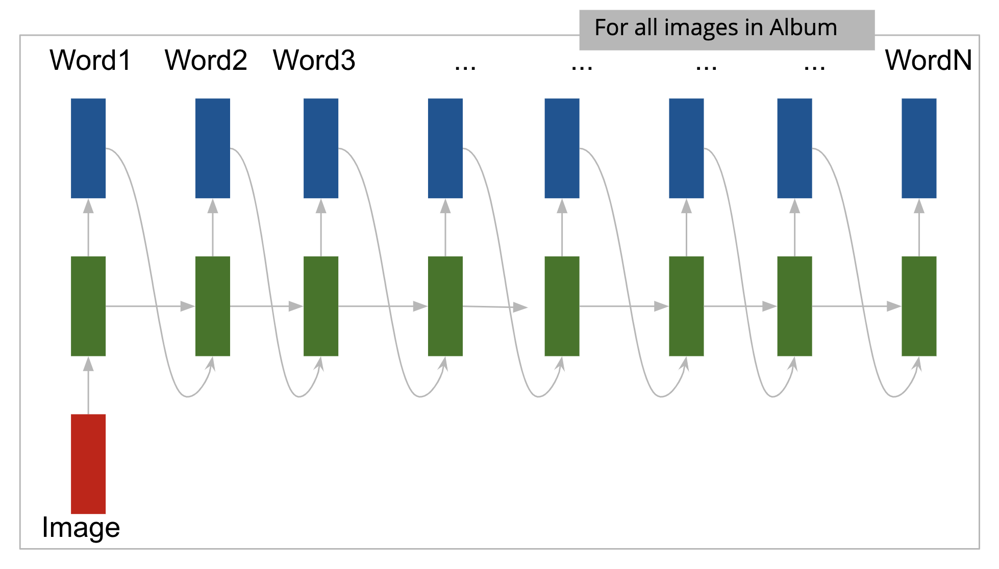
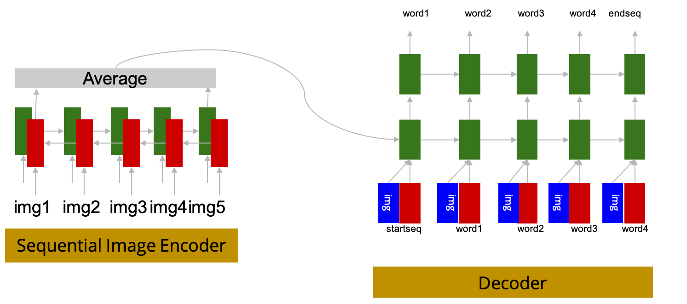
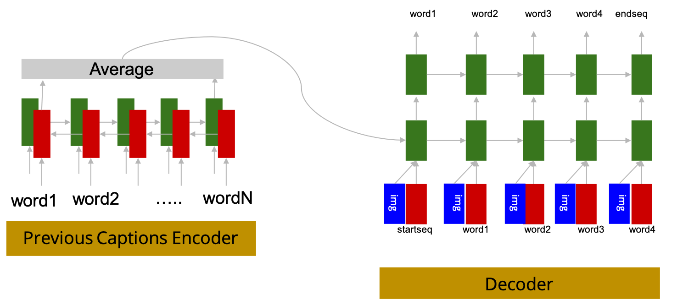
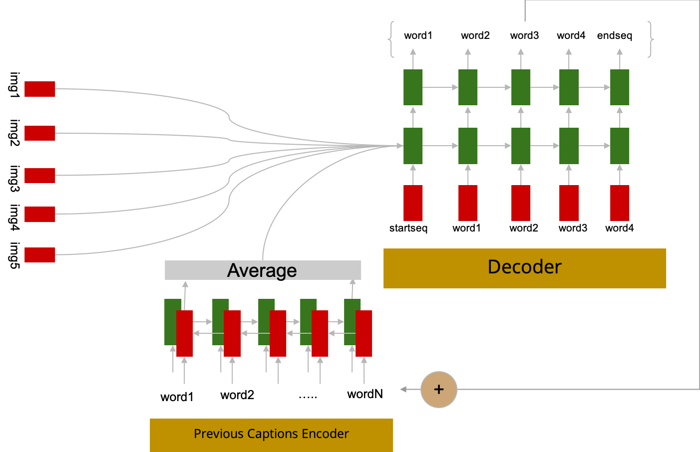

# Project Details
## Baseline 1 Model

We started off our exploration with a simple Image Caption problem where we generate captions to individual images in an album or story and concatenate them to generate a narration to the story. With so many Image Captioning models out there, generating sensible and meaningful captions was never much of a challenge. Also, when captions for related sequence of images are concatenated it resulted in a neat, coherent narration.

> Problem solved? No, there's always a "but".

But, when a sequence of unrelated images were fed into this model it resulted in a narration which had minimum coherence across individual captions. The narration used wide variety of terms ranging from “fireworks” to “the apple on the tree” and thus made no sense. 

Nonetheless, this model served its purpose of producing a good benchmark for further experiments.
## Baseline 2 Model

<!--- commented since it seems redundant given the dataset part in the appendix --->
<!--- Thought the dataset claims to have <#number> of images, there is a huge subset of captions which doesn’t have their respective images <#link to the FAQ> and also vice versa. 
However, we do include these captions in this baseline model but with the respective image embeddings of zero (signifies the unavailability of the context) which is similar to what we do in case of text - UNK token. This also results in ample availability of data to train the decoder as a simple language model. --->
A natural extrapolation to the previous model that we explored involved concatenation of the feature representations of all the images to generate a story or album embedding which is fed into a language model (Decoder) to generate a narration for the entire album.

### Pre-Processing
Preprocessing of images is done in the same way as the other models, but we limit the vector dimension to a relatively smaller size before feeding it into the language model by passing it through a Dense layer. These vectors are concatenated to get the feature representation of the story. All the captions in a story are concatenated which results in a coherent narration.
 
### Claims:
The problem of lack of coherence across captions in the initial model (as it’s just a concatenation of captions) is taken care in this model by passing the story feature representation. Also, the Decoder can be trained independently on other text corpuses to improve the quality of the text generated and these weights can be fine tuned when we feed in the images - Transfer learning.

### Cons:
Story embedding typically would be a long vector and thus learning the weights would be a bottleneck during training time. Furthermore, the narration generated by the language model is quite long and the context given by the story embedding is not carried over down the timesteps of the RNN. This is a typical issue with any RNN based language model (even if we use LSTM/GRU). One solution would be to use a Transformer based model which has attention heads on the images in the story, thus retaining the context (which is not done in this model).

## Alternative Models Tried
To resolve the problems of the proposed model, We have experimented with many variations, and we are presenting the main three variations we tried. However, all these models did not provide any significant improvement compared to the proposed model, and were not able to resolve the problems of the proposed model. Hence they were discarded. They are mentioned here for the sake of completeness.

### Alternative Model 1

In this model, We have attempted to remove dependence of previous captions and relied solely on the encoded image sequence to derive the context of the images. We have also attemted to use multiple decoders, since grammatically, the first captions will sound grammatically different than the second caption and so on. However, This experiment did not produce significant improvements as well.

### Alternative Model 2

In this Experiment, Instead of concatenating the encoded images with the prev-captions encoder and passing that as initial state, we tried to pass the images as input to the decoder.

### Alternative Model 3

Ih this experiment, we removed the sequential image encoder and passed the images as they are to the model, with the hope that the features from each image are not lost or distorted while in the RNN, and that the image features are treated in isolation from other images. The context is simply derived from previously generated captions.

# Appendix
## Dataset
We use VIST dataset for our training and testing. Picking the grains from a dataset was very interesting journey for us. There were few surprises on the way. Here is something users of VSIT dataset should know about before using it:
- Not all the Albums have stories associated with them
- Similarly, not all the available stories have albums associated with them
- Most of the albums have multiple stories associated with them.

Once we filtered albums with images as well as associated stories, we started preprocessing out data.  
Structure of the data looks like : 
> {Data: 
>> {[album1:{[image1, image2, image3, image4, image5],[caption1, caption2, caption3, caption4, caption5]}] 
 >>      [[album2:{[image1, image2, image3, image4, image5],[caption1, caption2, caption3, caption4, caption5]}] 
 >>      . 
 >>      . 
 >>      [[albumn:{[image1, image2, image3, image4, image5],[caption1, caption2, caption3, caption4, caption5]}]}} 

It is also good to note that the stories in the dataset are very abstract and cantain big part of imaginary events that can/cannot be inferred directly from the image/image sequence.

### Data preprocessing
We used pretrained __Xception model__ from Keras to extract the features from the images. To represent the captions we went with __GLOVE__ embedding. Each image is represented as __[2048 dimension]__ vector and each caption is represented as __[300*max_sentences_length__] 

#### Training pair for Base Model1:

#### Training pair for Base Model2:

#### Training pair for final model:

##  Glossary
#### Album 
Album is a group of "n" images, Which might or might not have high visual corelation. (However a creative mind can generate a story by linking the dots) 
#### Caption
Caption is a group of words describing a given image.
#### Story 
Story is a group of captions describing an album (or sequence of images).
#### Image Embedding
Image features extracted from Xception model prior to the training phase (for optimization purposes).
#### Word Embeddings
Used GLOVE 300 embeddings to embed all words in each caption.

