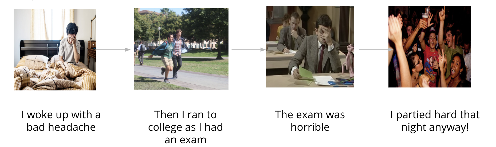
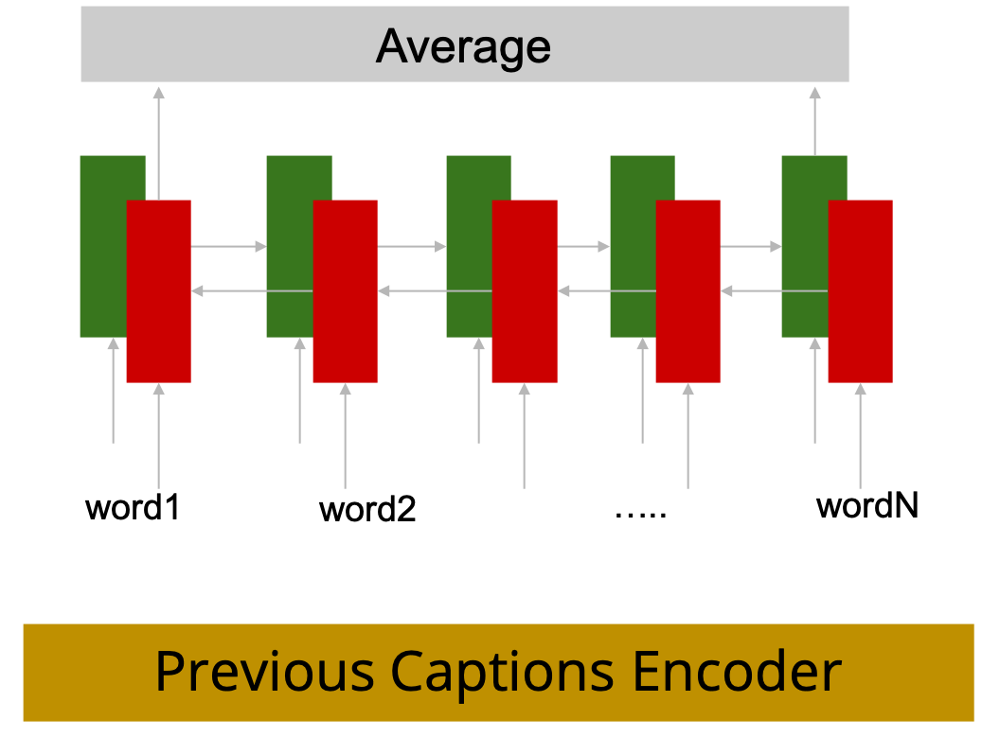
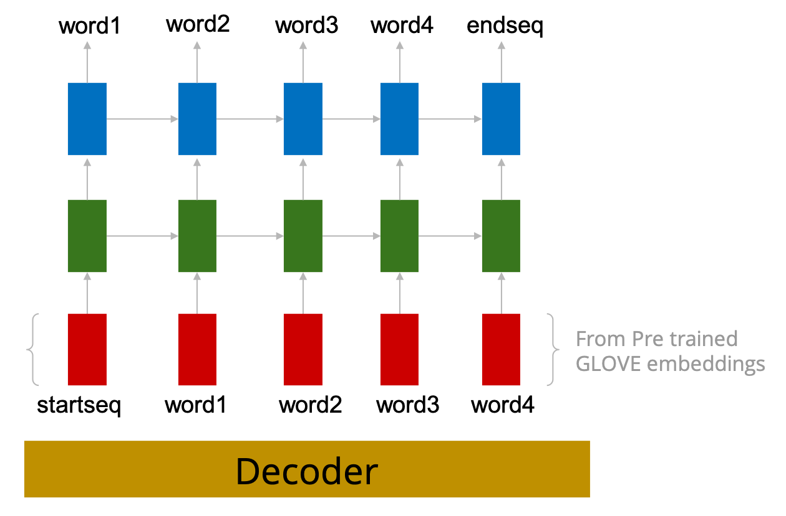
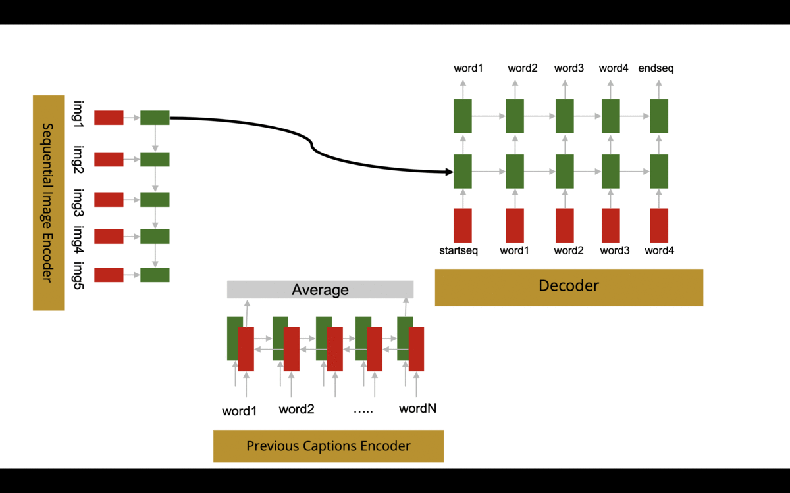
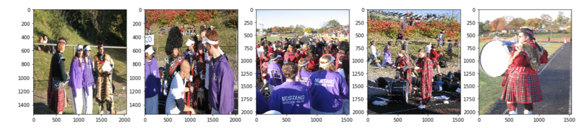
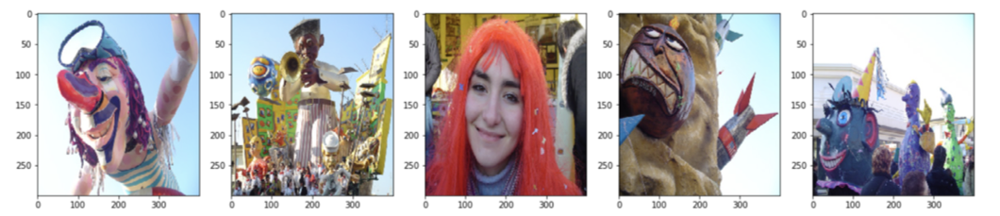
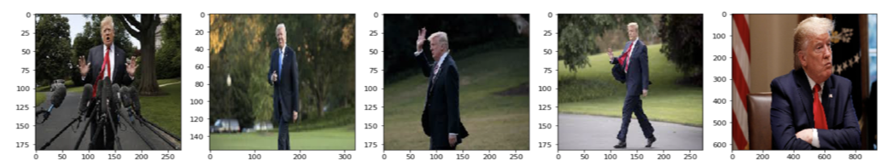

# Album Narration
Imagine a tool which generates an interesting story given an album of images. Be it a flash back of the year or a trip to one's favorite place, a story tagged with it would make one smile when they come back and browse their timeline. Needless to say, this could be a very useful plugin for photo sharing platforms like Instagram, Snapchat, Facebook, etc. If trained on domain specific data, this could also be used for automated scientific journals to make researchers lives easier. We will leave other possible usages to your imagination. :wink: 

## Problem

The Image Captioning task focuses on generating a description of a single image in isolation. There has been sufficient research on this task producing ground-breaking results. Video Summarization task, on the other hand, is a relatively harder task since it involves the selection of keyframes to be considered for summarization. Visual storytelling is an open problem in Deep Learning. Album Narration is an attempt to generate contextual image captions for a sequence of images such that, the whole album of images can be described with a cohesive and interesting story.


<p align="center"><em> Fig. 1: Sample narration</em></p>
<br>
To solve the Album Narration problem, we need a solution that meets in the middle of the 2 tasks mentioned: 

1. Reasoning about an image devoid of any context
1. Reasoning about a set of continuous frames with sufficient context

## Proposed Model
The intuition behind this model is to condition the current caption generation on context of previous information encountered. This context can be extracted from either images or all the previous sentences, or both. The current model uses previous information from both, previous images and previous captions. The Proposed model is composed of three main parts, image encoder, previous-caption encoder, and a decoder, all are explained in the following segments.
``` Please note that the graphs are made simple by removing dense layers/ activations/ dropouts/ regularization etc. for more details about these layers please take a look at the code in the repository. ```

### Image Encoder
The sequential image encoder expects 5 images and passes these images sequentially through a GRU that returns the output from each single timestep. The point of passing the images through a GRU is that instead of having information about individual images, we would rather have information for the current image, together with all previous images, in an effort to capture the context from all previously occurring events.
<p align="center">&emsp;&emsp;&emsp;&emsp;<p>

### Previous Caption Encoder
Second part is a previous caption encoder, which essentially encodes all previously generated captions into one single thought. The main point of doing that is to encourage the model to remember what all it previously generated so that it will not go further away from the storyline generated so far. Basically, the model is expected to stick to the story it started with. For example, if the next image had information about a man having fun, and the previously generated captions were: 
> I’m going out with my friends tonight

we would expect the story to continue with: 

> my friend is enjoying the party to the fullest

However, if the previous captions were:

> We are going to the carnival

next caption is expected to be more like

> This guy seems to be totally enjoying the event!

To do that, a bidirectional GRU is used to encode all previously generated captions.
<p align="center" ><p>

### Decoder
The decoder of the proposed model is expected to receive two encodings, an image and a caption to generate a current caption. Therefore, the decoder is re-used five times in the proposed model, once for every caption. The decoder is a GRU that uses a teacher-force method during the learning phase in order to speed up the learning process.
<p align="center">&emsp;&emsp;&emsp;&emsp;&emsp;&emsp;<p>

## Training
The model is trained end-to-end and is expected to generate all five captions all at once for each story during the training phase. 

<p align="center" ><p>

1. STEP 1:
For the first caption, the model takes the output from the first timestep of the image encoder and passes that as the first hidden state for the decoder. Further, the decoder uses image encoding and the initial caption to generate the very first caption. 

1. STEP 2:
After that, the model passes the decoder’s output for the first caption to the previous caption encoder and concatenates its output with the image encoder’s output for the second timestep. And then the model uses the concatenated encoding to initialize the first hidden state for the decoder and generates the second caption.

1.  STEP 3:
For the third caption, the same process is repeated, except now the previous caption encoder concatenates the decoder’s output from STEP 1 and STEP 2 to generate the encoding. 

1. STEPs 4, 5:
same as the previous process.

The model uses a **sparse cross entropy loss** (modified cross entropy loss that discards the use of one-hot encodings for words to make more efficient use of memory) where each word is treated as a class.  The model tries to lower the misclassifications for each timestep (each word position) for the entire story.

(Please note that during implementation, image features are pre extracted using Xception. Words are replaced by their indices, and later in the model are embedded in a freezed layer using glove 300 embeddings, ([click for more details about implementation and baseline models] (Extra.md))

## Inference
During Training, ground truth for captions are available, hence the model can learn all at once. However, during inference, ground truth ceases to exist. Hence, words are generated one by one. Unfortunately, there is no other straightforward way to feed previously generated words to the decoder during inference. The model is used for predicting every single word, so in the worst case the model will be called 100 times (5 captions, 20 words each) to generate a single story. For that reason, we used greedy search to get the story. Although beam search could lead to better results, it has been omitted due to the huge increase in processing just to generate a single story.

## Results
The proposed model gave the following stories for the sequence of images:
<p align="center" ></p>

> the fireworks started right the day. the soldier takes the stage to talk about the organization organization. the 4th of july displays are a lot of fun . the grand finale is happening in the distance. the grand finale is happening to the project.
<p align="center" ></p>

> the fireworks were gorgeous. i bought a new camera for the event. i wanted to capture them as clearly as possible. it was a lot of fun. afterward it was very smoky.


With a bit of imagination, we could pass these results as okay-ish, since they describe some kind of an event. However, when passing the following image sequence:

<p align="center" ></p>

We get the following story:

> the fireworks started right to start the day. the old plantations were fun to look at . the old fountain in the middle of the road was fun. the dragon ride was fun to behold. afterwards, the instructor greeted the fireworks.

Which also happens to start by describing fireworks, while the image sequence is devoid of any kind of event/carnival. This led us to go back and retrace our methods. The main observation is that the model is generating similar observations given extreme inputs (like the third example above). As an effort to remedy that, we tried to:
- Remove the influence of the previous sentences, to help the model recover from previous unrelated captions and derive the context from the image sequence alone
- Feed the image as an input to the decoder, together with the previously generated word to increase the influence of current image.
- Replaced RNNs in the image encoder with fully-connected layer(s) as an effort to isolate current image and reduce the noise from previous images.

([you can read about these models here](Extra.md))

All these methods (as well as our proposed approach) were able to achieve high accuracy during training. However, the generated stories were not relatable to the inputs in most of the cases. During these experiments, we were compromising with either the accuracy or the coherency. Since various encoding techniques (used for both images and captions) failed to improve the model behavior, we conclude with the thought that teacher-forced RNN decoders might not be well suited to solve this problem. 

## Future Work
- It is not easy to recover from a bad previous word in teacher-force methods. Hence, we can try non teacher-force method.
- Use skip-thought vectors to extract the context from previous sentences as they capture the meaning rather than word sequence.
- We can add an attention mechanism to the model for better understanding of images.
- Using a discriminator to criticize the network instead of a direct loss.
- Replace the current decoder with GAN to ensure that the generated sentences are not memorized but brand new.
- Reinforcement learning language model as the decoder, with a reward function that takes care of language and story coherence can also be tried.
