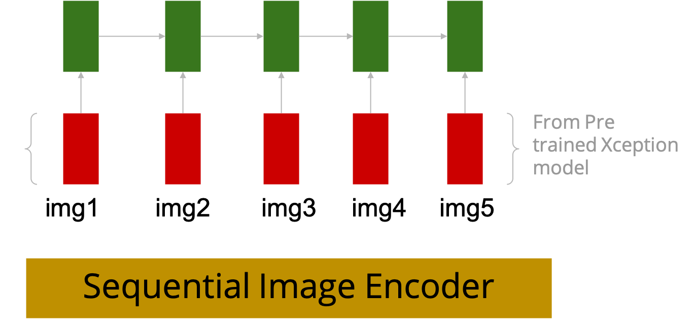

# Proposed Model
## Description
The Proposed model is composed of three main parts, First part is a sequential image encoder. The encoder expects 5 images and passes these images sequentially through a GRU that returns the output from each single timestep. The point of passing the images through a GRU is that instead of having information about individual  images, We would rather have information for the current image, together with all previous images, in an effort to essentially capture all previously occurring events.
<PIC: IMAGE ENCODER>

Second part is a previous captions encoder, which essentially encodes all previously generated captions into one single thought. The main point of doing that is to encourage the model to remember all what it previously generated so that it will not go further away from the story it started with. Basically, the model is expected to stick to the story it started with. For example, if the next image had information about a man having fun, and the previously generated captions were: “I’m going out with my friends tonight” we would expect the story to continue with “my friend is enjoying the party to the fullest”. However, if the previous captions were “We are going to the carnival”, next cation would be more like “This guy seem to be totally enjoying the event!”. To do that, a bidirectional GRU is used to encode all previously generated captions.
<PIC: CAPTIONS ENCODER>

Third part is the decoder. The decoder of the proposed model is expected to receive two encodings (image and caption) to generate every caption. Therefore, the decoder is re-used five times in the proposed model, once for every caption. The decoder is a GRU that uses a teacher force method during the learning phase in order to speed up the learning process.
<PIC: DECODER>

## Training
The model is trained end-to-end and is expected to generate all five captions all at once for each story during the training phase. 
### STEP 1:
For the first caption, the model takes the output from the first timestep of the image encoder, and passes that as the first hidden state for the decoder, and the decoder uses that, together with the caption input to generate the very first caption. 

### STEP 2:
After that, the model passes the decoder’s output for the first caption to the prev-captions encoder and concatenates the prev-captions encoder’s output together with the image encoder’s output for the second timestep. And then the model uses that to initialize the first hidden state for the decoder, and then the second caption is generated.
###  STEP 3:
For the third caption, the same process happens, except now the prev-captions encoder concatenates the decoder’s output from STEP 1 and STEP 2 to generate the encoding. 
### STEPs 4, 5:
same as the previous process.

The model uses a sparse cross entropy loss (modified cross entropy loss that discards the use of one-hot encodings for words to make more efficient use of memory) where each word is treated as a class.  The model tries to lower the mis-classifications for each timestep (each word position) for the entire story.

(Please note that during implementation, captions are truncated to length of 20 words and padded if captions contain less number of words. Also, words are replaced by their indices, and later in the model are embedded in a freezed layer using glove 300 embeddings)

# Results
